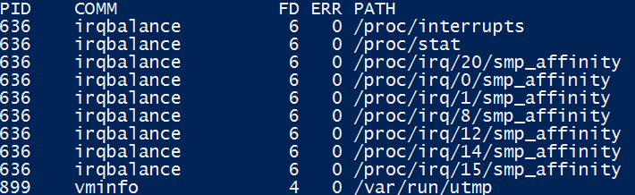

Ответы к заданию 3.3

1. chdir("/tmp")
2. Ведёт поиск в папке home пользователя файлов magic.mgc и magic потом в папке /etc теже файлы.
3. аа
4. Зомби не занимают памяти (как процессы-сироты), но блокируют записи в таблице процессов, размер которой ограничен для каждого пользователя и системы в целом.
5. 

6. Part of the utsname information is also accessible via  /proc/sys/kernel/{ostype, hostname, osrelease, version,  domainname}.

7. && - Оператор выполнит вторую команду только в том случае, если команда 1 успешно выполнена. ; - Оператор точка с запятой выполняет несколько команд одновременно последовательно и обеспечивает вывод без зависимости от успеха и отказа других команд. test -d /tmp/some_dir && echo Hi. Выведет Hi только если есть будет удачная отработка команды test. test -d /tmp/some_dir; echo Hi. Выведет Hi в любом случае. 
set -e: параметр указывает оболочке выйти, если команда дает ненулевой статус выхода. Проще говоря, оболочка завершает работу при сбое команды. Следовательно команда после && выполнена не будет в любом случае.

8. set -e - прекращает выполнение скрипта если команда завершилась ошибкой, выводит в stderr строку с ошибкой. 
set -u - прекращает выполнение скрипта, если встретилась несуществующая переменная.
set -x - выводит выполняемые команды в stdout перед выполнением.
set -o pipefail - прекращает выполнение скрипта, даже если одна из частей пайпа завершилась ошибкой. 
Данные параметры позволяют обезопасить выполнение скрипта, что бы при ошибках в скрипте он заканчивался корректно.

9. Три процесса со статусом S. 

(<) высокий приоритет.

(N) низкий приоритет.

(L) страницы заблокированы в памяти (для ввода-вывода в реальном времени и пользовательского ввода-вывода).

(s) является лидером сессии.

(l)  является многопоточным.

(+) находится в группе процессов переднего плана.
 
